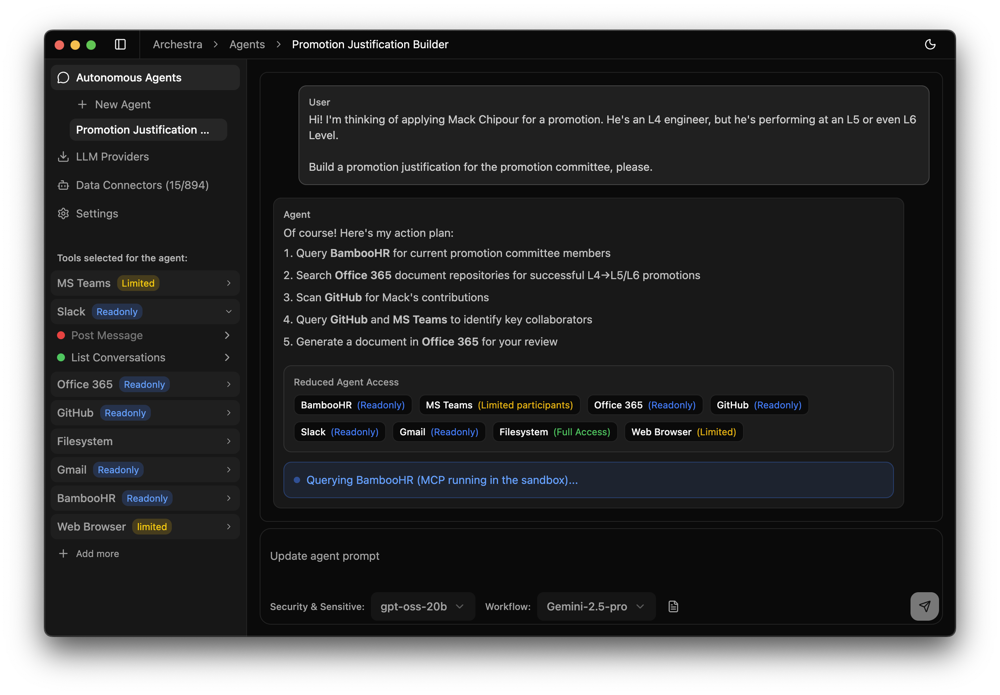

  
  
  # Archestra
  
  **Enterprise MCP Platform for AI Agents**
  
  
  
  
  
  [Website](https://archestra.ai)

---

## ⚠️ Early Development Notice

**Archestra is in very early development**, and it's not yet ready for general download.

**Want to get notified when we launch?** Drop your email at [archestra.ai](https://www.archestra.ai/) to be the first to know when Archestra is ready.

## 🚀 Overview

Archestra is an enterprise-grade platform that enables non-technical users to safely leverage AI agents and MCP (Model Context Protocol) servers. Built as a privacy-focused desktop application, Archestra provides a secure runtime environment for AI interactions with sandboxing, resource controls, and prompt injection prevention.

### Key Features

- 🔒 **Secure Runtime** - Isolated execution environment for AI agents with sandboxing and resource controls
- 🛡️ **Prompt Injection Prevention** - Advanced security to prevent context leakage and behavior manipulation
- 🔌 **MCP Protocol Support** - Compatible with thousands of existing MCP servers and custom implementations
- 💻 **Local-First Architecture** - Privacy-focused design with local LLM
- 🎯 **Enterprise Ready** - Built for non-technical users with enterprise-level security and compliance
- 🔧 **Extensible Tool System** - Support most of MCP servers: GitHub, Gmail, Slack, PostgreSQL, filesystem, and more
