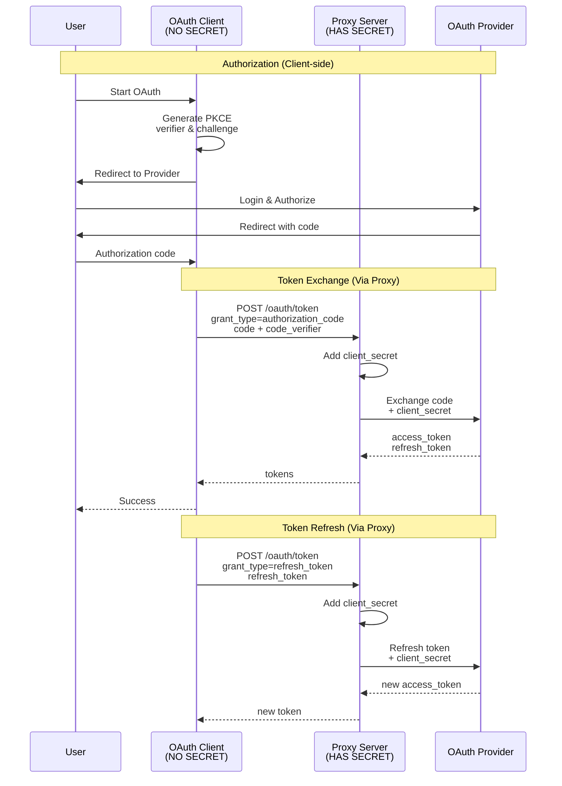

# OAuth Proxy Server

A secure, minimalistic OAuth proxy server built with Fastify that handles PKCE-based OAuth flows. The proxy adds client secrets server-side, keeping them secure while allowing public clients to complete OAuth flows.

## Architecture

The proxy acts as a secure middleware between OAuth clients (without secrets) and OAuth providers:



## Features

- 🔐 **Secure**: Client secrets never exposed to frontend
- 🚀 **Fast**: Built with Fastify for high performance
- 🔌 **Extensible**: Easy to add new OAuth providers
- 🛡️ **PKCE Support**: Full support for PKCE flow
- 📝 **Simple**: Minimal dependencies, clean architecture

## Installation

```bash
# Install dependencies
pnpm install

# Copy environment variables
cp .env.example .env

# Edit .env with your OAuth credentials
```

## Configuration

Edit `.env` file with your OAuth credentials:

```env
# Server
PORT=8080
LOG_LEVEL=info

# CORS
CORS_ORIGIN=http://localhost:3000,https://localhost:3000

# Google OAuth
GOOGLE_CLIENT_ID=your_client_id
GOOGLE_CLIENT_SECRET=your_client_secret

# Slack OAuth
SLACK_CLIENT_ID=your_client_id
SLACK_CLIENT_SECRET=your_client_secret
```

## Running the Server

### Development

```bash
pnpm dev
```

### Production

```bash
pnpm start
```

### With ngrok (https for slack, etc)

1. Install ngrok:

```bash
brew install ngrok/ngrok/ngrok
```

2. Start the server:

```bash
pnpm start
```

3. In another terminal, start ngrok:

```bash
ngrok http 8080
```

4. Use the provided HTTPS URL from ngrok for secure OAuth callbacks.
